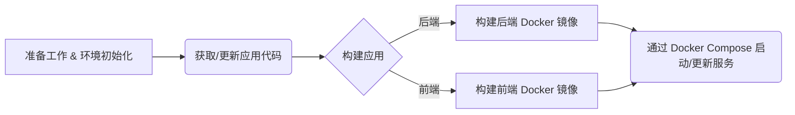

## 🚀  Docker + Docker Compose 应用部署实战指南

在现代软件开发中，如何快速、可靠地部署应用是每个开发者和运维工程师都关心的问题。今天，和大家分享一下我常用的基于 Docker 和 Docker Compose 的应用部署流程。

### ✨ 为什么选择 Docker 和 Docker Compose？

* **Docker 容器化** 📦：将应用及其所有依赖（库、运行时、系统工具等）打包到一个轻量级、可移植的容器中。
* **Docker Compose 服务编排** 🎶：当应用由多个服务组成时（比如后端 API、前端 Web、数据库、缓存服务等），Docker Compose 允许通过一个简单的 YAML 文件来定义和管理这些多容器应用。

### 🛠️ 我的通用部署流程概览

下面是我通常遵循的一套部署步骤，这套流程适用于大多数需要前后端分离构建和部署的项目：



---

### 📝 步骤详解

#### 1. 准备工作 & 环境初始化 ⚙️

在目标服务器上，我们通常会有一个专门用于部署的目录结构。

* **进入部署工作区**：
  ```bash
  cd /path/to/your/dev-ops-directory
  ```
* **核心配置文件**：
  这个目录下最关键的文件之一就是 `docker-compose.yml` 。这个文件定义了我们应用的所有服务、网络、数据卷以及它们之间的依赖关系。

#### 2. 获取/更新应用代码 🔄

部署新版本或进行更新时，首先需要从版本控制系统（通常是 Git）获取最新的代码。

* **为源码创建目录** (如果尚不存在):

  ```bash
  # 示例中是 卖票系统，你可以根据项目结构命名，当然也可以跟个阶段名sell-tickets-stage1，用来迭代上线
  mkdir -p "sell-tickets/backend"
  mkdir -p "sell-tickets/frontend"
  ```
* **克隆或拉取代码**：
  以后端代码为例：

  ```bash
  cd source-code/backend/
  # 如果是首次部署
  git clone <你的后端仓库地址> .
  # 如果是更新
  # git pull origin <分支名>
  git checkout <你的目标分支或标签> # 例如: main, v1.2.0, feature/new-feature
  
  # 检查是否检出成功，防止部署分支错误
  git branch
  ```

**检出特定分支进行部署是企业中非常普遍且推荐的做法**。前端代码也进行类似操作。

#### 3. 构建 Docker 镜像 🏗️

这一步是将源代码转换成可运行的 Docker 镜像。

* **后端应用构建 (以 Java/Maven 为例)**：

  ```bash
  cd /path/to/your/dev-ops-directory/source-code/backend/your-project-name/
  # 1. 编译打包应用
  mvn clean install
  # SpringBoot 启动类 target 目录下会产生一个jar包，供后续使用。
  ```

  这会在当前模块下创建一个 target 目录（如果尚不存在），并将编译打包后的可执行 JAR 包（或其他类型的制品）放置在该目录中。这也是后续 `Dockerfile` 中 ADD 指令通常会引用的路径。

  ```bash
  # 2. 构建 Docker 镜像
  # 通常我会在启动应用模块下放有一个 build.sh 脚本
  cd your-app-module/ # 比如 big-market-app
  chmod +x build.sh
  ./build.sh
  ```

  `build.sh` 脚本内部通常会执行 `docker build` 命令。一个典型的命令可能如下所示：

  ```bash
  docker build -t yujunpan/sell-ticket:1.3 -f ./Dockerfile .
  ```

    * -t ：给镜像打上标签 (tag)。yujunpan/sell-ticket:1.3是镜像的名称（通常是[仓库用户名或组织名]/[应用名]的格式），1.3 是版本号。这个标签非常重要，后续**docker-compose.yml**文件会通过这个标签来引用镜像。
    * -f ./Dockerfile：显式指定 Dockerfile 文件的路径。虽然如果 Dockerfile 就叫 Dockerfile 且在当前目录下，可以省略** **-f ./Dockerfile**，但明确指定是一个好习惯。
    * . ：指定构建上下文 (build context) 的路径。这意味着 Docker 引擎会将这个目录下的所有文件（根据 dockerignore 排除）发送给 Docker守护进程，Dockerfile 中的 ADD 或 COPY 等指令将基于此上下文路径来查找文件。
      我们来看这个 `docker build `命令会用到的一个典型的后端 Dockerfile 示例：

```dockerfile
# 基础镜像
FROM openjdk:8-jre-slim

# 作者
MAINTAINER yourname@example.com

# 配置 (可选, 可以在 docker-compose.yml 中覆盖)
ENV PARAMS=""

# 时区设置
ENV TZ=Asia/Shanghai
RUN ln -snf /usr/share/zoneinfo/$TZ /etc/localtime && echo $TZ > /etc/timezone

# 添加应用 (假设 mvn install 后 JAR 在 target 目录)
ADD target/your-app-name.jar /app.jar

# 暴露端口 (可选, 可以在 docker-compose.yml 中映射)
# EXPOSE 8080

# 启动命令
ENTRYPOINT ["sh","-c","java -jar $JAVA_OPTS /app.jar $PARAMS"]
```

* **前端应用构建 (以 Node.js 应用为例)**：

  ```bash
  cd /path/to/your/dev-ops-directory/source-code/frontend/your-front-project-name/
  # 1. 构建静态资源 (具体命令视项目而定)
  # npm install
  # npm run build
  
  # 2. 构建 Docker 镜像 (同样通过 build.sh)
  chmod +x build.sh
  ./build.sh
  ```

  前端的 `build.sh` 通常会将构建好的静态文件（HTML, CSS, JS）打包到一个 Nginx 或其他轻量级 Web 服务器的 Docker 镜像中。

在执行完 build.sh 脚本（内部调用了 **docker build**）后，我们可以通过以下命令查看本地的 Docker 镜像列表，确认新镜像是否已成功构建并带有正确的标签：

```bash
docker images
```

应该能在列表中看到类似 yujunpan/sell-ticket-app:1.3 (根据 docker build -t 命令中的标签) 这样的条目，以及它的大小和创建时间。

#### 4. 通过 Docker Compose 启动/更新服务 🚀

所有需要的镜像都构建完毕并推送到镜像仓库（或在本地可用）后，就轮到 Docker Compose 登场了。在企业实践中，我们常常会将 Docker Compose 的配置拆分成多个文件，以提高可维护性和灵活性。

* **典型的 Compose 文件结构：**

    * **`docker-compose-app.yml` (或 `app.yml`, `base.yml` 等):** 这个文件通常定义了应用的核心服务、它们使用的镜像（即我们前面步骤构建的镜像）、基础端口映射、依赖关系、默认网络等。
    * **`docker-compose-environment.yml` (或 `docker-compose.prod.yml`, `docker-compose.dev.yml`):** 这个文件用于启动应用运行所需要的环境，比如Mysql，Redis，MQ等。
    *
* **回到部署工作区**：

  ```bash
  cd /path/to/your/dev-ops-directory
  ```
* **启动或更新服务 (使用多个 Compose 文件)**：
  或者也可以逐个启动。

  ```bash
  docker-compose -f docker-compose-app.yml -f docker-compose-environment.yml up -d
  ```

    * `up`: 创建并启动容器。如果服务已经运行，并且其配置或引用的镜像已更改，Compose 会重新创建它们。
    * `-d`: 在后台（detached mode）运行容器。

这种分层配置的方式使得基础服务定义保持干净，同时又能灵活地为不同环境定制部署细节。是一个良好的实践方式，这样做有以下好处：

1. **清晰分离**：基础服务定义与环境特定配置分离。
2. **可维护性**：`app.yml` (或 `docker-compose.yml`) 通常不怎么变动，而 `docker-compose-environment.yml` 会根据部署环境的不同而有所调整。
3. **可重用性**：基础的 `app.yml` 可以在多个项目或场景中作为模板。


### 💡 进阶与思考

* **CI/CD 自动化** 🤖：上述手动步骤非常适合理解流程，但在实际生产中，强烈建议将这些步骤集成到 CI/CD 流水线中（如 Jenkins, GitLab CI, GitHub Actions），实现自动化构建和部署。
* **镜像仓库** 🏢：构建好的 Docker 镜像应该推送到一个集中的镜像仓库（如 Docker Hub, Harbor, AWS ECR, Google GCR），Compose 文件再从仓库拉取镜像，而不是依赖本地构建。
* **配置管理** 🔑：敏感信息（如数据库密码）不应硬编码在 Dockerfile 或 `docker-compose.yml` 中，应使用环境变量、Docker Secrets 或专门的配置服务来管理。
* **日志与监控** 📊：确保配置了合适的日志收集和监控方案，以便跟踪应用状态和排查问题。
* **健康检查与回滚** ❤️‍🩹：在 `docker-compose.yml` 中为服务定义健康检查，并制定好部署失败时的回滚策略。

### 🎉 总结

通过 Docker 和 Docker Compose，我们可以搭建一个标准化、可重复的部署流程。这不仅降低了环境差异带来的风险，也让团队协作更加顺畅。希望这篇分享能帮助你更好地理解和应用这套强大的工具。

如果你有任何问题或更好的实践，欢迎在评论区留言交流。👇

---
